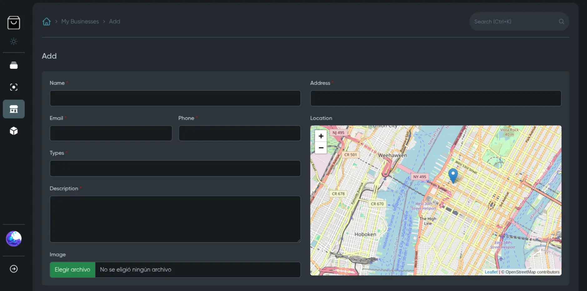
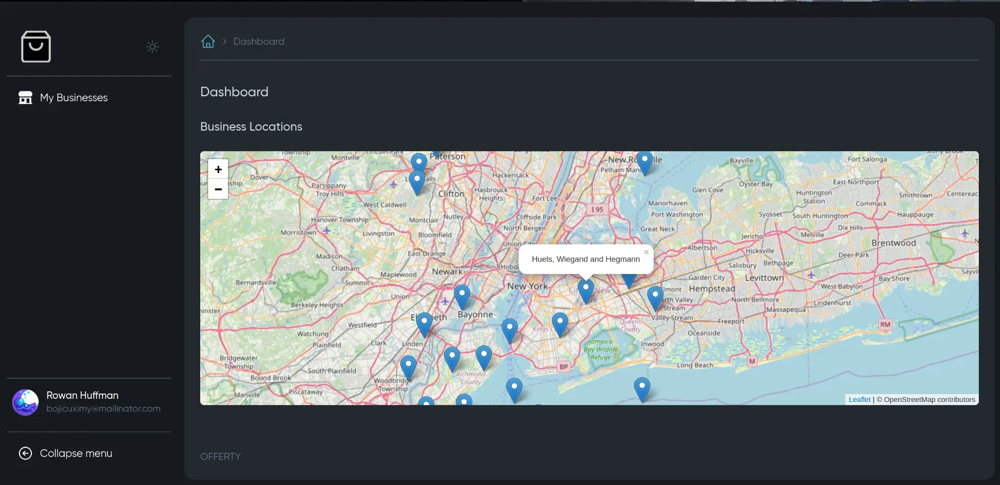

# Leaflet field for [MoonShine Laravel admin panel](https://moonshine-laravel.com)

MoonLeaflet adds a map field to your forms, letting users pick their location using a Leaflet map. It's perfect for saving latitude and longitude easily. In table and detail views, it shows an icon that links to Google Maps with the saved coordinates for quick access.

| Field  | Component  |
|----------------|-------------------|
|  |  |


### Requirements

- MoonShine v3.0+

### Support MoonShine versions

| MoonShine | MoonLeaflet |
| --------- | ----------- |
| 3.0+      | 1.0, 2.0    |


## Installation

```shell
composer require maycolmunoz/moon-leaflet
```

## Usage

### Field

```php
use MaycolMunoz\MoonLeaflet\Fields\LeafletField;

LeafletField::make('Location') // label
    ->initialPosition(latitude: 40.7580, longitude: -73.9855) //initial position
    ->columns('latitude', 'longitude') // columns in database
    ->isDraggable(true) // default is true
    ->minZoom(5) // min zom
    ->maxZoom(18) // max zoom
    ->zoom(14), // initial zoom
```

### Component

```php
use MaycolMunoz\MoonLeaflet\Components\LeafletMap;

// Each item must include 'name', 'latitude', and 'longitude' attributes
$items = Business::all()
    ->map(function (Business $business) {
        return [
            'name' => $business->name,
            'latitude' => $business->latitude,
            'longitude' => $business->longitude,
        ];
    });

LeafletMap::make(label: 'Business Locations', items: $items->toArray()) // label and items
    ->initialPosition(latitude: 40.7580, longitude: -73.9855) //initial position
    ->minZoom(5) // min zom
    ->maxZoom(18) // max zoom
    ->zoom(14) // initial zoom,
```

Note: The map will attempt to use the user's current location if location services are enabled. If no location is provided, the map will default to coordinates (0, 0).
